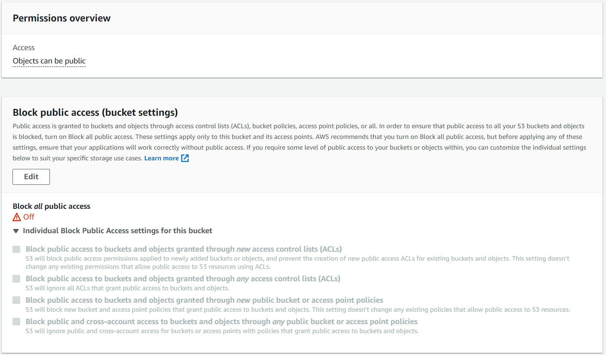

# Part 3 - Secure Bucket via IAM

## With AWS Management Console

- Click on the `Permissions` tab

  

- The "Bucket Policy" section shows it is empty. Click on the Edit button

- Enter the following bucket policy replacing `my-website-bucket-123456789123` with the name of your bucket and click "Save"

  ```json
  {
    "Version": "2012-10-17",
    "Statement": [
      {
        "Sid": "PublicRead",
        "Effect": "Allow",
        "Principal": "*",
        "Action": ["s3:GetObject", "s3:GetObjectVersion"],
        "Resource": ["arn:aws:s3:::my-website-bucket-123456789123/*"]
      }
    ]
  }
  ```

You will see warnings about making your bucket public, but **this step is required for static website hosting**


## With AWS CLI

Make sure you set up a CLI profile with `aws configure`

In case you are using a different profile than `default`, remember to add `--profile <Profile Name>` at the end of each command

Also, remember replacing `my-website-bucket-123456789123` with the name of your bucket

- Create a Policy Document file (`public-s3.json`)

  ```json
  {
    "Version": "2012-10-17",
    "Statement": [
      {
        "Sid": "PublicRead",
        "Effect": "Allow",
        "Principal": "*",
        "Action": ["s3:GetObject", "s3:GetObjectVersion"],
        "Resource": ["arn:aws:s3:::my-website-bucket-123456789123/*"]
      }
    ]
  }
  ```

- Update S3 bucket's policy document
  ```sh
      aws s3api put-bucket-policy \
          --bucket my-website-bucket-123456789123 \
          --policy file://public-s3.json
  ```

## Footnote

If we were not learning about static website hosting, we could have made the bucket private and wouldn't have to specify any bucket access policy explicitly. In such a case, once we set up the **CloudFront distribution**, it will automatically update the current bucket access policy to access the bucket content. The CloudFront service will make this happen by using the **Origin Access Identity** user.
